## What is Biohub 2.0?

Biohub 2.0 is a synthetic biology community, focusing on more efficient Biobricks information retrieval and more convenient biological ideas sharing. It is constructed on the basis of iGEM's official database. The parts inside are filtered and ordered intelligently, and presented to users in a friendly way. Users can grade the parts they've used, or post critical articles under them and exchange ideas with other users. All the data collected in the community will be used for more accurate ordering.

More than a community, Biohub 2.0 is also a flexible plugin system, which allows users to develop new functions and integrated them into the platform. Plugins will have full access to the community's data, so plugin developers can make further analysis of the parts. It's also welcome to deploy plugins that implement useful synthetic biological algorithms. With this mechanism, new tools and algorithms can be acquainted by other scientists more quickly.

## Motivation

The numerous parts provided by iGEM Parts Registry are precious to the biologists, but unfortunately displayed in a terrible way. For synthetic biologists with little or no knowledge about programming, the only approach to access the parts is by submitting the search box on the official pages, which is however too crude to use. The default matching algorithm defies multi-dimensional searching, and the default ordering is just wasting users' time. It's hopeless to get anything useful via this tool. Thus, a software to mine high-quality parts accurately is urgently needed.

With the data dumped from iGEM Parts Registry, which contains information like sample status or used times, the parts can be roughly ranked. But further ranking can only be accomplished after experiments are done, which requires the assistance from the whole community. Such feedback mechanism does exist in iGEM Parts Registry, which is called Experiences, but is seldom used probably because of its hard-to-use interface. We think a user-friendly forum centred on Biobricks is necessary, where users can grade the parts they've used, or share experiences with other scholars. The forum on the one hand complements the data used for more accurate ranking, and on the other hand provides a platform for idea exchanging.

The parts data can be used for various purposes, but apparently we are not able to achieve all of them. In consideration of this, we decide to make our software extensible. Developers with ideas to better make use of the data may develop their own plugins, and embed them into the software. With the help of forum, such plugins will be acquainted quickly, and accelerate the development of synthetic biology.

## Features

### BioSearch

BioSearch is a powerful search engine against Biobricks, with high performance and great accuracy. It's one of the core part of Biohub 2.0. You can access it via the search box on th top:

Just type anything you want to learn about a part and press Enter, in less than one second you will get the results:

The bricks are ordered by their qualities and creation date, which means you are always able to get the best and latest one to meet your need. The quality of bricks are ranked by several factors, including frequency of use, sample status, and assessments from users in forum, and so on. Each brick is displayed with a progress bar at the right bottom corner, which represents the relative ranking.

BioSearch supports multi-dimensional filtering. You can use `t:<type>` to limit the type of bricks:

or use `n:<part name>` to precisely locate a brick using its name:

or add an `h:` filter to mark out the matched words:

Multiple filters can also be combined to make complex query:

For each brick, Biohub will automatically fetch its relevant data from iGEM's offical website, and keep them updated. Biohub owns the same data as iGEM Parts Registry, but organizes and displays them in a much neater way. You may learn more details of a specific brick by clicking its part name:

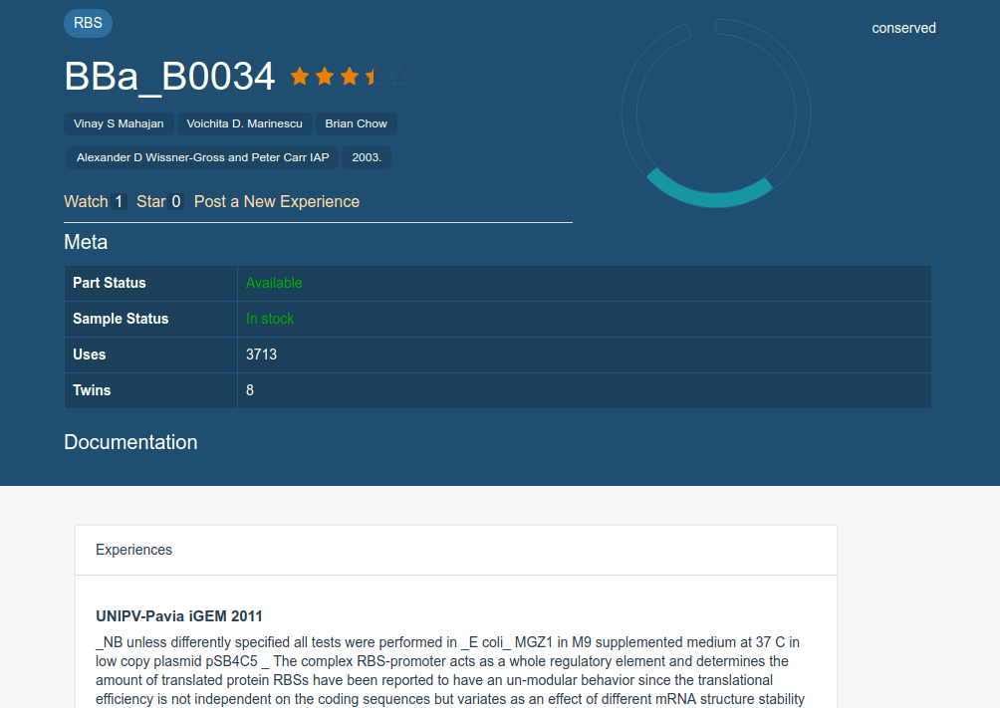

The meta table contains basic information of a brick. Initially it is folded, but you can expand it by clicking its header:

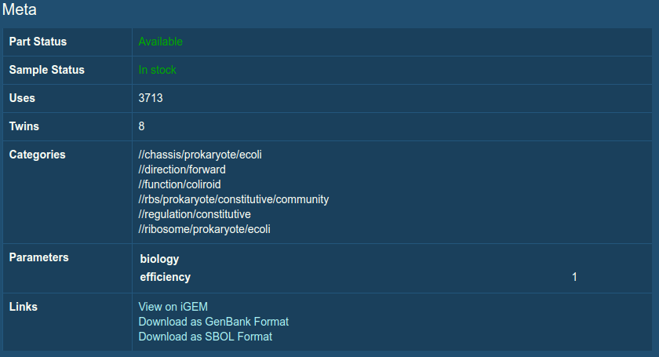

By clicking "Documantation", you can view the full description of a brick:

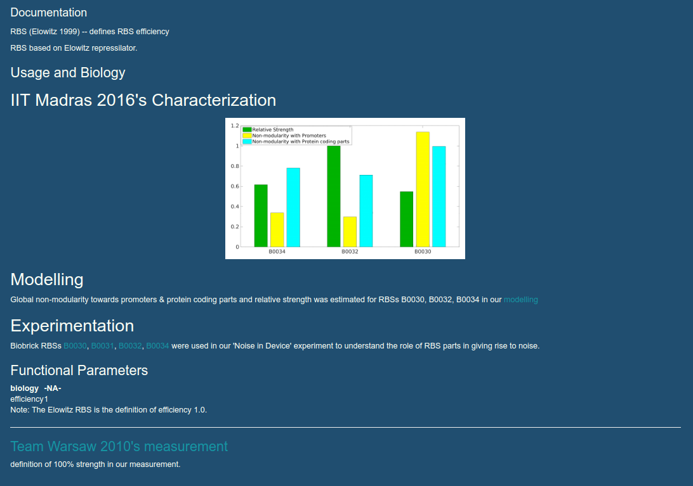

At the top right corner of the page, you will find a circular graph, which illustrates the structure of the brick. Each arc represents a special sequence part, arranged based on its position relative to the brick. You can learn more information by moving your mouse onto them:

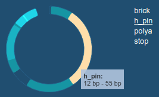

For those sequences that are also bricks (called subparts), clicking on them will direct you their detail pages.

If a brick contains subparts, they will be displayed at the bottom of the page as well:

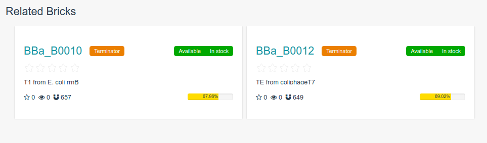

### Forum

Forum is another essential constituent part of Biohub 2.0. It establishes a platform where users can share and discuss their experience. "Experience" is the core concept of Forum. An experience is an article belongs to a specific brick, stating experiment phenomenon and/or providing improvement advices. To post an experience, just click the button on the detail page:

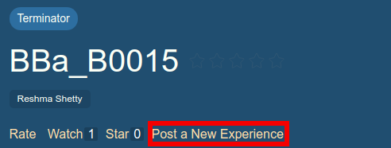

Experiences use Markdown for typography, so you can use few easy-to-remember tags to format your article:

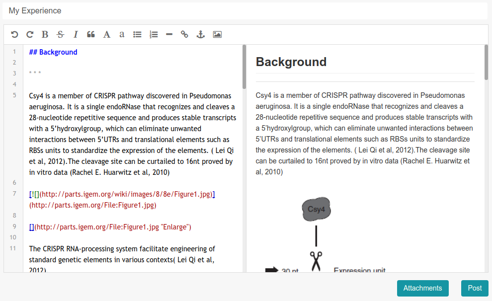

After submitting, your experience will then be displayed on the brick's detail page.

You may vote for an experience if you find it great enough:

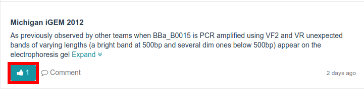

Or if you disagree with the author, you may leave a comment:

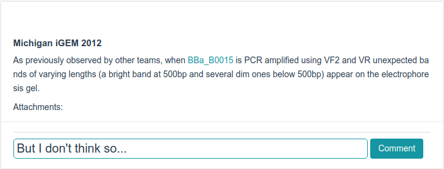

The idea of sharing experiences are actually inspired by iGEM's offical website, which also has a similar submodule. Few articles have already existed on the website, which we think is a kind of valuable resources. Thus Forum will grab down and display those experiences while fetching data from iGEM, and make a refresh per 10 days to keep them up-to-date.

Apart from experience sharing, Forum also allows you to interact with the bricks:

There are three kinds of actions related to bricks:

 + **Rate** You can grade a brick (0 ~ 5 points) according to your own using experience.
 + **Watch** If you watch a brick, you will receive notifications when other users post experiences. Events related to the brick will also appear on your timeline.
 + **Star** Star is in a sense a kind of mark. If you meet an interesting brick but have no time to skim through its document, you can just star it for later viewing.

Forum calculates the popularity of bricks in real time. The most popular ones will be displayed on the home page:

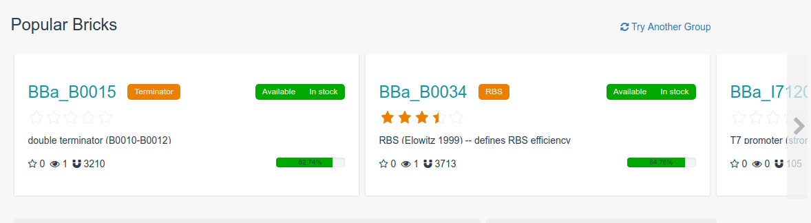

Plenty of data will be generated in Forum every day, and Biohub will use them to correct the deviation of bricks ranking. For every 30 minutes, the system will recalculate quality of the bricks with the help of data such as star numbers or popularity.

### Plugin System

From the very beginning, Biohub 2.0 is designed as a plugin system. Such idea is originated from the project of USTC-Software 2016, which had a defective plugin system. Compared with theirs, the plugin system of Biohub 2.0 has these new features:

 + **Hot Reloadable** All components of Biohub 2.0 are designed to be self-reloadable, which means servers need not to be restarted while installing or uninstalling plugins.
 + **More Utilities** Biohub 2.0 encapsulates varieties of modules to simplify plugin development, including URL routing, background tasks, websocket dispatching, file handling, and so on.
 + **Full Access to the System** Biohub 2.0 doesn't have sand-box mechanism, which means plugins can take all advantages of th operating system. But uploaded plugins should be checked manually by us as a consideration of security.

By default, Biohub 2.0 carries 3 plugins, you can find them in the "Plugins" page.

#### BioMap

As a demonstration of how to use bricks data in plugins, we build BioMap. BioMap is a gadget to analyze the relationship between different bricks. Simply type the brick name you want to analyze and click the corresponding button, a graph will be shown to visualize the relationship:

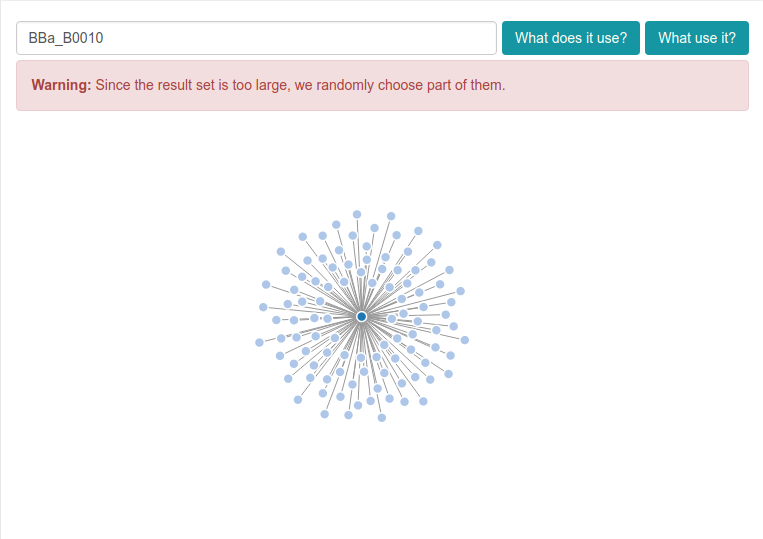

Since the result set may be very large in reversed relationship querying, we will compress them by only displaying a portion of them as you can see.

You can select the nodes inside to perform further analysis:

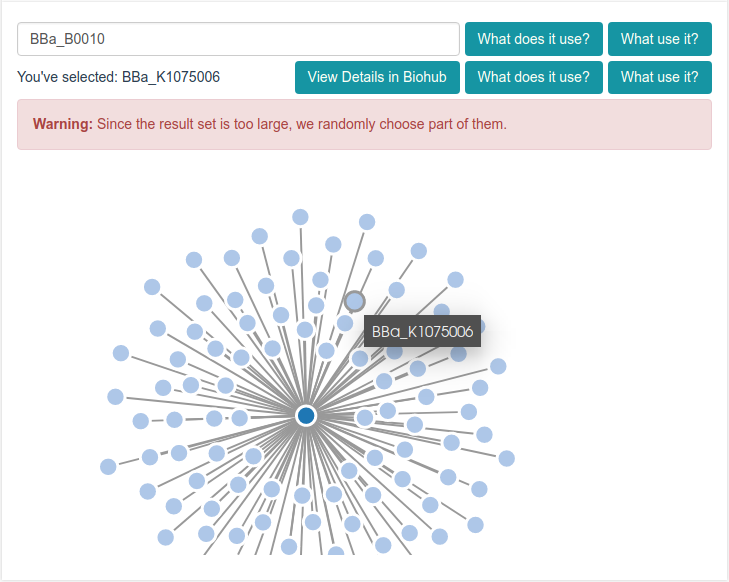

BioMap have preprocessed and cached the relationship network while deploying, so it will not consume much time to accomplish the analysis.

#### ABACUS

ABACUS is a tool to design amino acid sequence from a given protein. Proteins are specified in Protein Data Bank format. The uploaded `.pdb` will be evaludated by simulated annealing algorithm, and another `.pdb` file representing the result will be returned. To upload a sample, simply click the "Upload and Compute" button and choose the file:

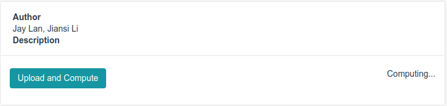

The computation will take several minutes to accomplish. You may browse other pages during this time, and an notification will be sent after the task done. ABACUS will visualize the structure of the result:

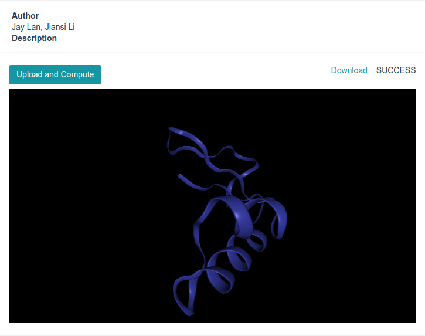

Such design process is a computation intensive work, so ABACUS may not be able to handle certain samples due to memory limitation. By then a notification will be sent to inform you of the failure.

#### BioCircuit

The design of robust and sensitive biological circuit are always bothering. To rationally design synthetic gene circuits with specific functions, we write BioCircuit. The plugin is an adpatation of the project BioBLESS developed by USTC-Software 2015, with the ability to design digital circuit, biological circuit as well as analyze the performance of them.

<!-- to do -->

## To Be Improved

As an upgrade version of Biohub 1.0, we've achieved quite a lot, but there's still something imperfect, due to technical or time limitation. One is that users cannot upload their own plugins freely as a consideration of security. We will try to add sand-box mechanism in the future, whilst still providing enough freedom for plugins. Another is that the project lacks a scaffold for plugin developers, which may confuse them while setting up developing environment. Also, the plugin system lacks a detailed documantation for developers. We will keep updating the repository and gradually fill these blanks in the future.
