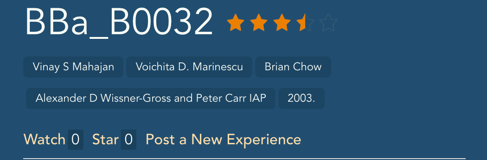

## Validation

### Forum
We check each function of our forum to assure that it works as we expected.

+ **Watch**: After clicking the link "**Watch**", the number of watching users increased.
    - Before: 
    - After: 

+ **Rate**: After clicking the link "**Rate**", a component designed for rating will appear beneath it. If brick rated by user, the link "**Rate**" will be hidden. The average score will be displayed in terms of stars.
    - Not Rated: 
    - Rated: 

+ **Star**: The validation can repeat in the same way.
    - Not Starred: 
    - Starred: 