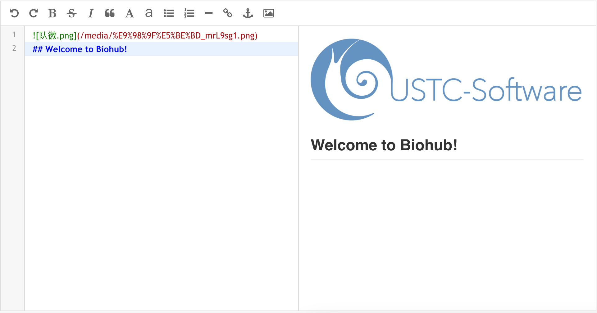

## Validation

### Forum
We check each function of our forum to assure that it works as we expected.

+ **Watch**: After clicking the link "**Watch**", the number of watching users increased.
    - Before: 
    - After: 

+ **Rate**: After clicking the link "**Rate**", a component designed for rating will appear beneath it. If brick rated by user, the link "**Rate**" will be hidden. The average score will be displayed in terms of stars.
    - Not Rated: 
    - Rated: 

+ **Star**: The validation can be repeated in the same way.
    - Not Starred: 
    - Starred: 

+ **Posting Experiences**: Posting experiences with pictures is a good test case for experiences module.

The Markdown language has been parsed and the image uploaded inserted into the right place.The editor will compile the users' input whenever the content changes, providing real-time preview for better experience.

+ **Experiences Displaying**:

The experience posted just now has the same view as what we get in the editor. An unique key will be assigned to it for direct access.

+ **Comments**:

### BioSearch
Type anything you want to learn about a part and press Enter, in less than one second you will get the results:

    
The bricks are ordered by their qualities and creation date, which means you are always able to get the best and latest one to meet your need. The quality of bricks are ranked by several factors, including frequency of use, sample status, and assessments from users in forum, and so on. Each brick is displayed with a progress bar at the right bottom corner, which represents the relative ranking.

BioSearch supports multi-dimensional filtering. You can use `t:<type>` to limit the type of bricks:

or use `n:<part name>` to precisely locate a brick using its name:

or add an `h:` filter to mark out the matched words:

Multiple filters can also be combined to make complex query:

